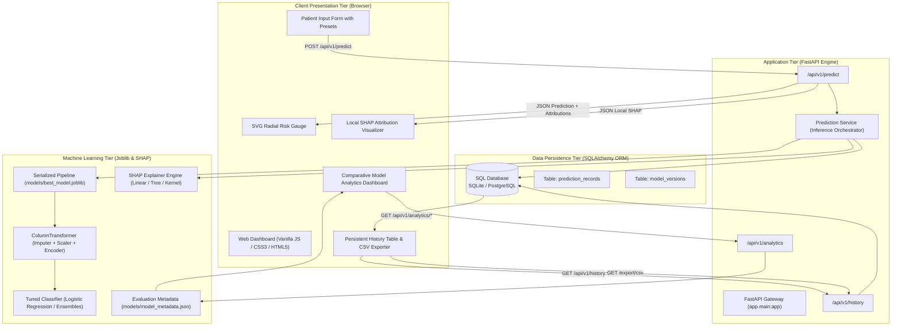
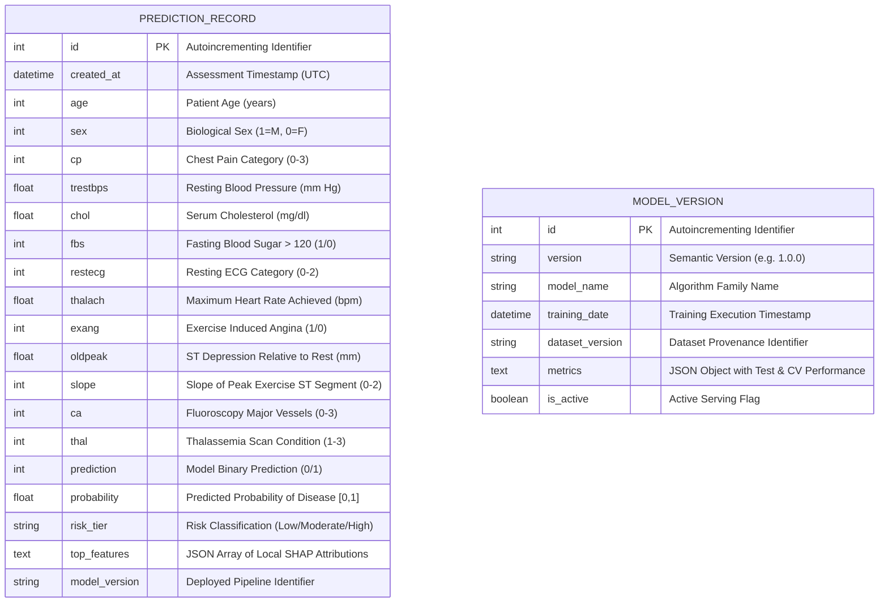
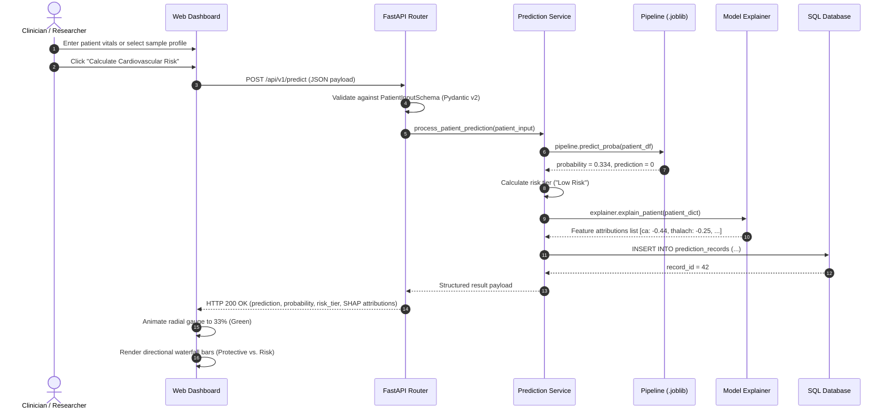

# System Architecture Document

## 1. Executive Architecture Overview

The **Cardiovascular Risk Machine Learning System** is engineered as a decoupled, reproducible, data-intensive web system developed as a final Bachelor's graduation project.

The system integrates four distinct subsystems:
1. **Machine Learning & Feature Pipeline Subsystem**: Offline reproducible pipeline handling data ingestion, stratified leakage-free preprocessing, 7-model training, hyperparameter optimization, and SHAP explainability.
2. **Persistence Subsystem**: Relational database (SQLAlchemy ORM) supporting dual modes: SQLite (zero-setup for development) and PostgreSQL (production).
3. **Application & REST API Subsystem**: Asynchronous FastAPI service delivering strict schema validation (Pydantic v2), inference orchestration, history querying, and research analytics.
4. **Client-Side Presentation Subsystem**: Modern responsive single-page dashboard featuring clinical parameter forms, animated radial risk gauges, directional SHAP attribution charts, and research analytics.

---

## 2. High-Level Architecture Diagram

---

## 3. Database Entity-Relationship (ER) Diagram

---

## 4. End-to-End Prediction & Explainability Sequence Diagram

---

## 5. Technology Stack Rationale

| Layer | Chosen Technology | Architectural Justification |
|---|---|---|
| **Runtime** | Python 3.12 | Modern type-hinting support, native performance optimizations, long-term support. |
| **Data Processing** | NumPy & pandas | Standard high-performance vectorized operations on tabular clinical structures. |
| **Machine Learning** | scikit-learn | Strict API standard, zero data leakage with `Pipeline` and `ColumnTransformer`, built-in cross-validation and hyperparameter search. |
| **Model Explainability** | SHAP (Shapley Additive exPlanations) | Game-theoretic foundation ensuring local accuracy, missingness, and consistency properties. |
| **Web API Framework** | FastAPI & Uvicorn | Native async support, high throughput, automatic OpenAPI specification generation, dependency injection. |
| **Data Validation** | Pydantic v2 | High-speed Rust-based input validation with clear clinical range constraints. |
| **Persistence / ORM** | SQLAlchemy 2.0 | Decoupled database engine supporting SQLite for rapid local runs and PostgreSQL for enterprise containers. |
| **Containerization** | Docker & Compose | Guarantees 100% environment reproducibility across Linux, macOS, and Windows. |
